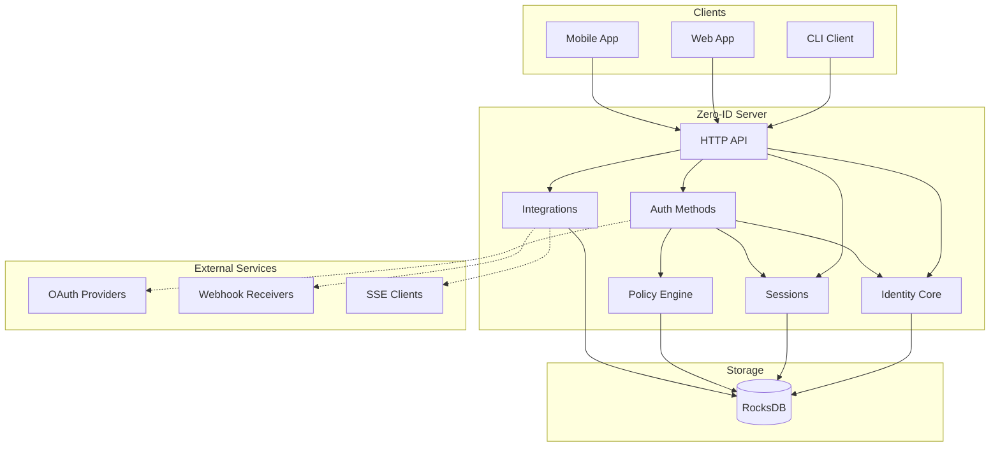
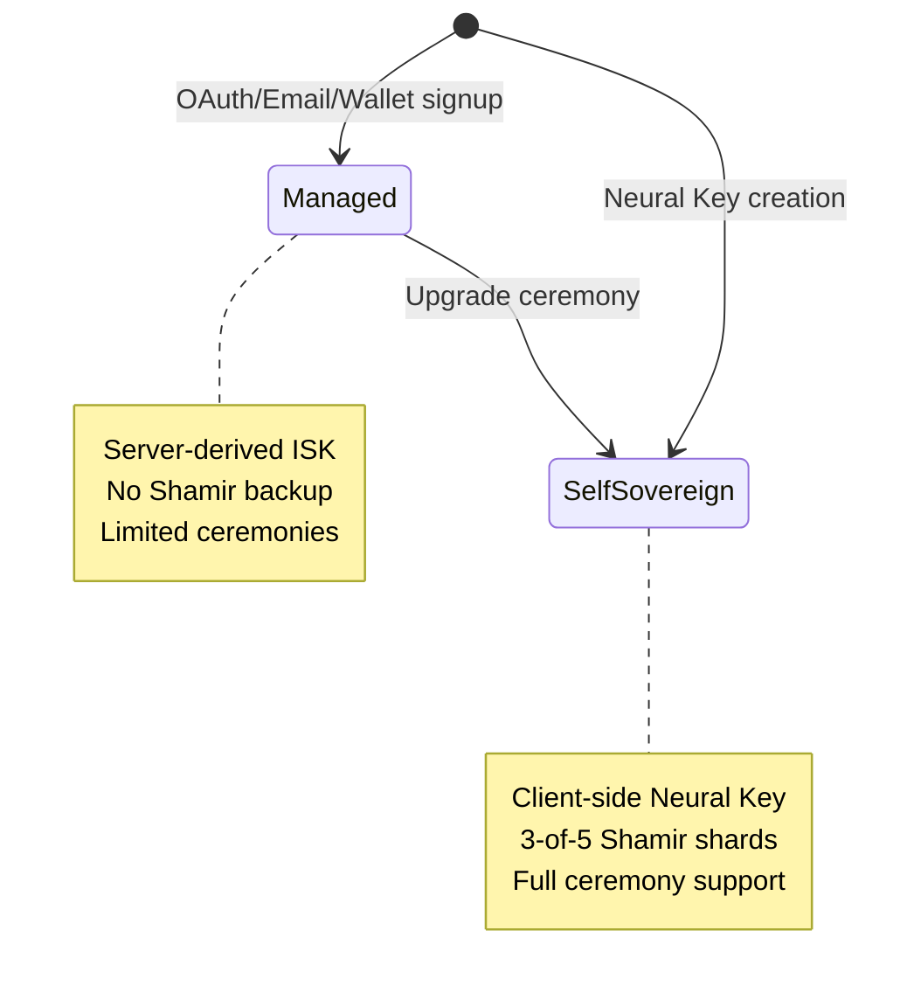
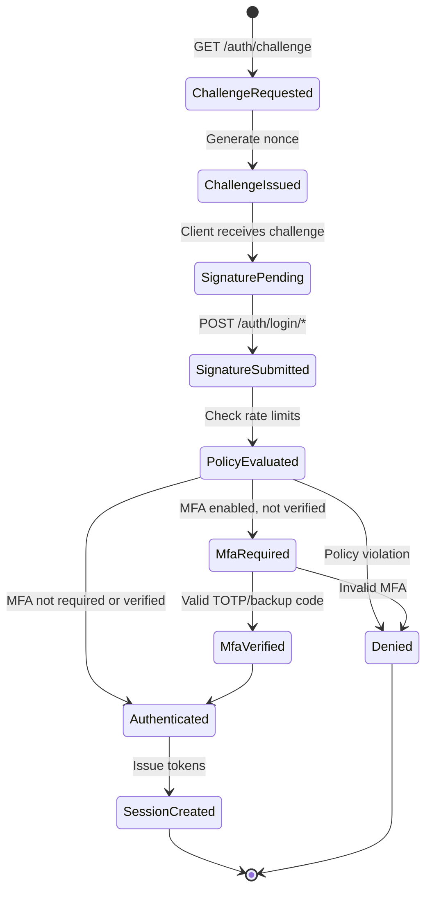
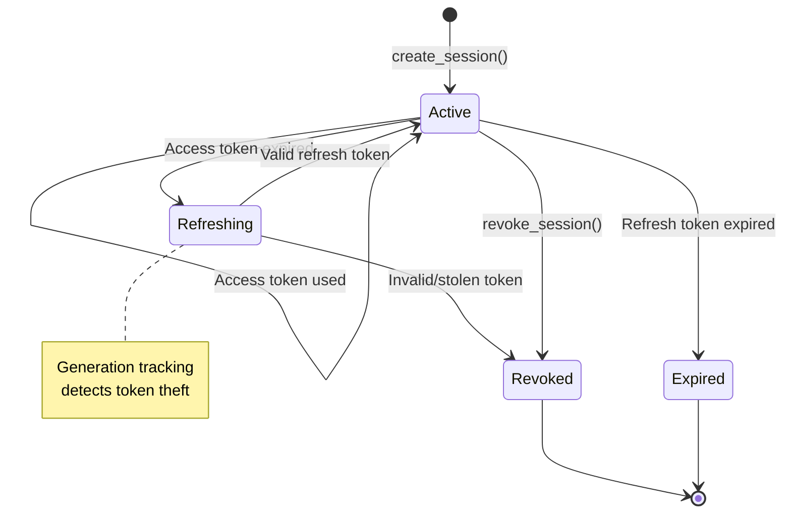
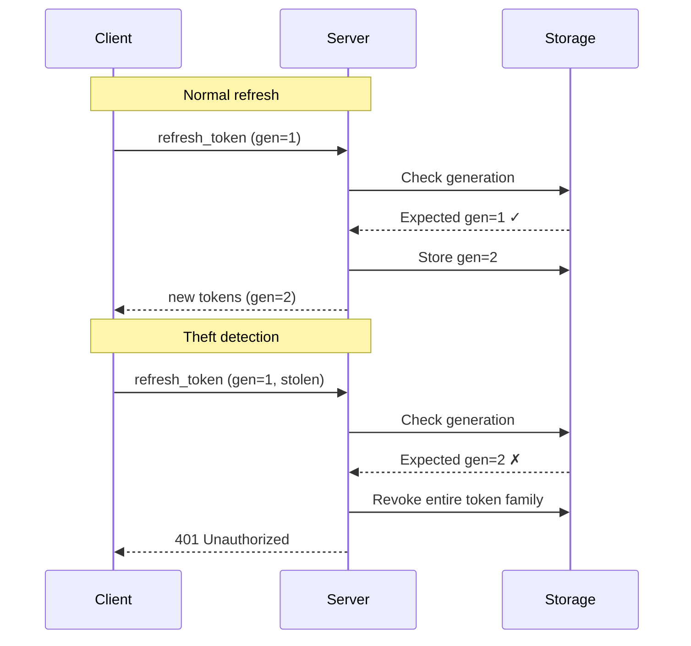
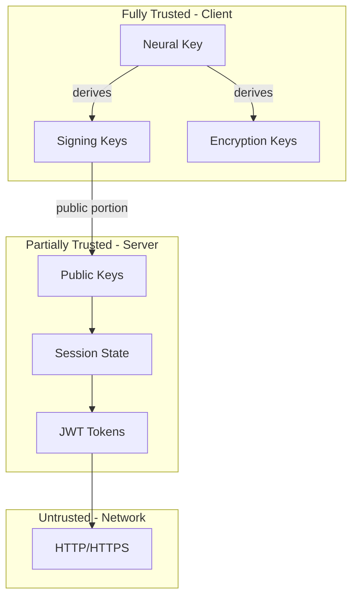
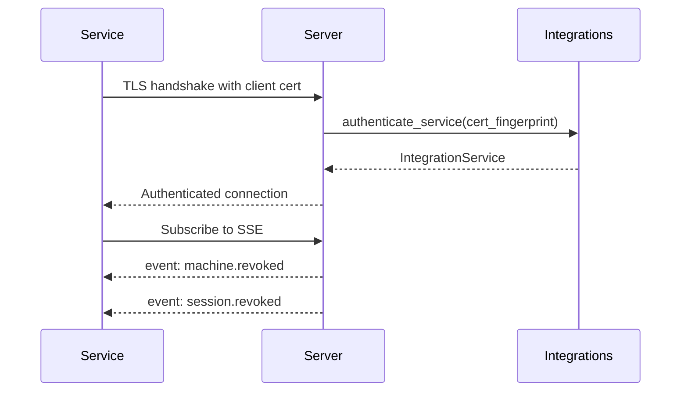

# Zero-ID System Overview v0.1.1

## 1. Introduction

Zero-ID is a cryptographic identity and authentication system built on **neural keys** — client-generated root secrets that never leave the user's device. The system provides both self-sovereign identity management (where users control their own keys) and managed identity support (for traditional OAuth/email authentication flows).

### 1.1 Design Philosophy

| Principle | Description |
|-----------|-------------|
| **Zero-Knowledge Server** | Server never sees Neural Key or private keys |
| **Client-Side Cryptography** | All key generation and signing happens on the client |
| **Machine-Based Authentication** | Devices authenticate via cryptographic challenge-response |
| **Hierarchical Key Derivation** | All keys derived deterministically from Neural Key |
| **Dual Identity Tiers** | Support for both self-sovereign and managed identities |
| **Post-Quantum Ready** | Optional ML-DSA-65 + ML-KEM-768 hybrid keys |

### 1.2 Core Concepts

| Concept | Description |
|---------|-------------|
| **Neural Key** | 32-byte root secret, client-generated, never transmitted |
| **Identity** | A cryptographic entity identified by its signing public key |
| **Machine** | A device authorized to act on behalf of an identity |
| **Namespace** | Logical grouping for access control and multi-tenancy |
| **Session** | Time-bound authentication state with JWT tokens |
| **DID** | Decentralized Identifier in `did:key` format |

---

## 2. Architecture

### 2.1 System Components



### 2.2 Crate Dependency Graph

```
┌─────────────────────────────────────────────────────────────────┐
│                      Application Layer                          │
│         zid-server    zid-methods    zid-client                 │
└───────────────────────────┬─────────────────────────────────────┘
                            │
                            ▼
┌─────────────────────────────────────────────────────────────────┐
│                        Domain Layer                             │
│    zid-identity-core   zid-sessions   zid-policy                │
│    zid-integrations                                             │
└───────────────────────────┬─────────────────────────────────────┘
                            │
                            ▼
┌─────────────────────────────────────────────────────────────────┐
│                         Core Layer                              │
│                  zid-crypto    zid-storage                      │
└─────────────────────────────────────────────────────────────────┘
```

#### Detailed Dependencies

```
┌─────────────────────────────────────────────────────────────────────────────┐
│ APPLICATION                                                                 │
│                                                                             │
│  zid-server ─────┬──────────────────────────────────────────┐               │
│       │          │                                          │               │
│       ▼          │                                          │               │
│  zid-methods ────┼────────┬─────────────────┐               │               │
│       │          │        │                 │               │               │
│       │          │        │                 │               │               │
│  zid-client      │        │                 │               │               │
│       │          │        │                 │               │               │
├───────┼──────────┼────────┼─────────────────┼───────────────┼───────────────┤
│ DOMAIN           │        │                 │               │               │
│       │          │        │                 │               │               │
│       │          ▼        ▼                 ▼               ▼               │
│       │   zid-identity  zid-sessions   zid-policy   zid-integrations        │
│       │        │  │          │  │           │               │               │
│       │        │  │          │  │           │               │               │
├───────┼────────┼──┼──────────┼──┼───────────┼───────────────┼───────────────┤
│ CORE  │        │  │          │  │           │               │               │
│       │        │  │          │  │           │               │               │
│       ▼        ▼  │          ▼  │           │               │               │
│  zid-crypto ◀─────┴─────────────┘           │               │               │
│                                             │               │               │
│  zid-storage ◀──────────────────────────────┴───────────────┘               │
│                                                                             │
└─────────────────────────────────────────────────────────────────────────────┘
```

| Crate | Layer | Dependencies |
|-------|-------|--------------|
| `zid-crypto` | Core | (none) |
| `zid-storage` | Core | (none) |
| `zid-policy` | Domain | zid-storage |
| `zid-integrations` | Domain | zid-storage |
| `zid-sessions` | Domain | zid-crypto, zid-storage |
| `zid-identity-core` | Domain | zid-crypto, zid-storage, zid-policy |
| `zid-client` | Application | zid-crypto |
| `zid-methods` | Application | zid-crypto, zid-identity-core, zid-sessions, zid-policy |
| `zid-server` | Application | zid-methods, zid-identity-core, zid-sessions, zid-integrations, zid-policy, zid-storage |

### 2.3 Crate Responsibilities

| Crate | Layer | Responsibility |
|-------|-------|----------------|
| `zid-crypto` | Core | Key derivation, encryption, signatures, Shamir secret sharing, DID |
| `zid-storage` | Core | Storage abstraction, RocksDB implementation, 33 column families |
| `zid-policy` | Domain | Rate limiting, reputation scoring, authorization decisions |
| `zid-identity-core` | Domain | Identity, machine, and namespace lifecycle management |
| `zid-integrations` | Domain | mTLS service auth, SSE streaming, webhook delivery |
| `zid-sessions` | Domain | JWT issuance, token refresh, introspection, key rotation |
| `zid-methods` | Application | Machine, email, OAuth, wallet, and MFA authentication |
| `zid-server` | Application | HTTP API, middleware, request handling |
| `zid-client` | Application | CLI interface, local credential storage |

---

## 3. Identity Model

### 3.1 Identity Tiers

Zero-ID supports two identity tiers:



| Tier | ISK Source | Shamir Backup | Ceremonies | Use Case |
|------|-----------|---------------|------------|----------|
| **Managed** | Server (from service master key) | No | Limited | Traditional auth flows |
| **Self-Sovereign** | Client (from Neural Key) | Yes (3-of-5) | Full | Maximum security |

### 3.2 Key Hierarchy

```
NeuralKey (32 bytes, client-generated, never leaves device)
│
├─── Identity Signing Key (ISK)
│    ├── Algorithm: Ed25519
│    ├── Derivation: HKDF("cypher:id:identity:v1" || identity_id)
│    └── Purpose: Signs machine enrollments, key rotations
│
├─── Machine Keys (per machine_id, epoch)
│    ├── Machine Seed: HKDF("cypher:shared:machine:v1" || identity_id || machine_id || epoch)
│    │
│    ├── Classical Keys
│    │   ├── Signing Key (Ed25519)
│    │   │   └── HKDF(seed, "cypher:shared:machine:sign:v1" || machine_id)
│    │   └── Encryption Key (X25519)
│    │       └── HKDF(seed, "cypher:shared:machine:encrypt:v1" || machine_id)
│    │
│    └── Post-Quantum Keys (optional, PqHybrid mode)
│        ├── Signing Key (ML-DSA-65)
│        │   └── HKDF(seed, "cypher:shared:machine:pq-sign:v1" || machine_id)
│        └── KEM Key (ML-KEM-768)
│            └── HKDF(seed, "cypher:shared:machine:pq-kem:v1" || machine_id)
│
└─── MFA KEK
     ├── Derivation: HKDF("cypher:id:mfa-kek:v1" || identity_id)
     └── Purpose: Encrypts MFA TOTP secrets at rest
```

### 3.3 DID Format

Identities have a Decentralized Identifier in `did:key` format:

```
did:key:z6MkhaXgBZDvotDkL5257faiztiGiC2QtKLGpbnnEGta2doK
        └────────────────────────────────────────────────┘
                    multibase-encoded public key
```

The DID is derived from the Identity Signing Public Key using:
- Multicodec prefix: `0xed01` (Ed25519 public key)
- Multibase encoding: `z` (base58btc)

---

## 4. Authentication Methods

### 4.1 Supported Methods

| Method | Primary Factor | Second Factor | Identity Tier |
|--------|----------------|---------------|---------------|
| **Machine Key** | Ed25519 signature | Optional TOTP | Self-Sovereign |
| **Email/Password** | Argon2id hash | Optional TOTP | Managed |
| **OAuth** | Provider token | Optional TOTP | Managed |
| **Wallet** | SECP256k1/Ed25519 signature | Optional TOTP | Managed |

### 4.2 Authentication Flow State Machine



### 4.3 MFA Support

- **TOTP**: RFC 6238 compliant, 6-digit codes, 30-second step
- **Backup Codes**: 10 single-use codes, generated at setup
- **Enforcement**: Per-namespace policy configuration

---

## 5. Session Management

### 5.1 Token Types

| Token | Algorithm | Lifetime | Purpose |
|-------|-----------|----------|---------|
| Access Token | EdDSA (Ed25519) | 15 minutes | API authorization |
| Refresh Token | Random (256-bit) | 30 days | Token renewal |

### 5.2 Session Lifecycle



### 5.3 Refresh Token Security

Refresh tokens use generation tracking to detect theft:



---

## 6. Storage Schema

### 6.1 Column Families (33 total)

| Category | Column Families | Count |
|----------|-----------------|-------|
| **Identity** | `identities`, `identities_by_did`, `machine_keys`, `machine_keys_by_identity`, `machine_keys_by_namespace`, `namespaces`, `identity_namespace_memberships`, `namespaces_by_identity` | 8 |
| **Auth** | `auth_credentials`, `mfa_secrets`, `challenges`, `used_nonces` | 4 |
| **Auth Links** | `auth_links`, `auth_links_by_method`, `primary_auth_method` | 3 |
| **OAuth** | `oauth_states`, `oauth_links`, `oauth_links_by_identity`, `oidc_nonces`, `jwks_cache` | 5 |
| **Wallet** | `wallet_credentials`, `wallet_credentials_by_identity` | 2 |
| **Sessions** | `sessions`, `sessions_by_identity`, `sessions_by_token_hash`, `refresh_tokens`, `refresh_tokens_by_family`, `signing_keys` | 6 |
| **Integrations** | `integration_services`, `integration_services_by_cert`, `revocation_events`, `processed_event_ids`, `webhook_delivery_log` | 5 |
| **Policy** | `reputation` | 1 |

### 6.2 Key Format Conventions

```
Primary key:     {entity_id}
Index key:       {parent_id}:{child_id}
Composite key:   {type}:{id1}:{id2}

Examples:
  identities: 550e8400-e29b-41d4-a716-446655440000
  machine_keys_by_identity: (550e8400-..., 660f9511-...)
  sessions_by_token_hash: blake3(token)
```

---

## 7. Security Model

### 7.1 Trust Boundaries



### 7.2 Cryptographic Algorithms

| Purpose | Algorithm | Security Level |
|---------|-----------|----------------|
| Signing | Ed25519 | 128-bit |
| Key Exchange | X25519 ECDH | 128-bit |
| Encryption | XChaCha20-Poly1305 | 256-bit key, 192-bit nonce |
| Hashing | BLAKE3 (fast), SHA-256 (compat) | 256-bit |
| Password Hashing | Argon2id | 64 MiB, 3 iterations |
| Secret Sharing | Shamir 3-of-5 over GF(256) | Information-theoretic |
| JWT Signing | EdDSA (Ed25519) | 128-bit |
| PQ Signing | ML-DSA-65 (FIPS 204) | NIST Level 3 |
| PQ KEM | ML-KEM-768 (FIPS 203) | NIST Level 3 |

### 7.3 Attack Mitigations

| Attack | Mitigation |
|--------|------------|
| Neural Key theft | 2+1 shard split (device + passphrase + user shard) |
| Replay attacks | Challenge nonces with 60-second expiry |
| Token theft | Short-lived access tokens (15 min), generation tracking |
| Refresh token theft | Generation tracking, family revocation |
| Brute force | Argon2id, rate limiting, reputation system |
| Machine compromise | Per-device keys, immediate revocation, epoch rotation |

### 7.4 Rate Limiting

| Resource | Default Limit | Window |
|----------|---------------|--------|
| IP requests | 100 | 1 minute |
| Identity requests | 1000 | 1 hour |
| Failed attempts | 5 | 15 minutes |

---

## 8. Integration Points

### 8.1 Service Authentication

External services authenticate via mTLS with X.509 client certificates:



### 8.2 Event Types

| Event | SSE Name | Payload |
|-------|----------|---------|
| Machine revoked | `machine.revoked` | machine_id, identity_id, reason |
| Session revoked | `session.revoked` | session_id, machine_id |
| Identity frozen | `identity.frozen` | identity_id, reason |
| Identity disabled | `identity.disabled` | identity_id |

### 8.3 Webhook Delivery

- **Retry Policy**: Exponential backoff (1s, 2s, 4s, 8s, 16s, max 32s)
- **Max Retries**: 5 attempts
- **Signature**: HMAC-SHA256 in `X-Zero-Auth-Signature` header
- **Timeout**: 30 seconds per request

---

## 9. Configuration

### 9.1 Environment Variables

| Setting | Variable | Default |
|---------|----------|---------|
| Server bind address | `BIND_ADDRESS` | `127.0.0.1:9999` |
| Database path | `DATABASE_PATH` | `./data/zid.db` |
| Service master key | `SERVICE_MASTER_KEY` | Required in prod |
| Run mode | `RUN_MODE` | `prod` |
| JWT issuer | `JWT_ISSUER` | `https://zid.zero.tech` |
| JWT audience | `JWT_AUDIENCE` | `zero-vault` |
| Access token expiry | `ACCESS_TOKEN_EXPIRY_SECONDS` | `900` (15 min) |
| Refresh token expiry | `REFRESH_TOKEN_EXPIRY_SECONDS` | `2592000` (30 days) |
| CORS origins | `CORS_ALLOWED_ORIGINS` | `http://localhost:3000` |
| Trusted proxies | `TRUSTED_PROXIES` | (empty) |

### 9.2 OAuth Configuration

| Provider | Client ID | Client Secret | Redirect URI |
|----------|-----------|---------------|--------------|
| Google | `OAUTH_GOOGLE_CLIENT_ID` | `OAUTH_GOOGLE_CLIENT_SECRET` | `OAUTH_GOOGLE_REDIRECT_URI` |
| X | `OAUTH_X_CLIENT_ID` | `OAUTH_X_CLIENT_SECRET` | `OAUTH_X_REDIRECT_URI` |
| Epic | `OAUTH_EPIC_CLIENT_ID` | `OAUTH_EPIC_CLIENT_SECRET` | `OAUTH_EPIC_REDIRECT_URI` |

---

## 10. API Endpoints

### 10.1 Health

| Method | Path | Purpose |
|--------|------|---------|
| GET | `/health` | Liveness probe |
| GET | `/health/ready` | Readiness probe |

### 10.2 Authentication

| Method | Path | Purpose |
|--------|------|---------|
| GET | `/v1/auth/challenge` | Get challenge for machine auth |
| POST | `/v1/auth/login/machine` | Machine key authentication |
| POST | `/v1/auth/login/email` | Email/password authentication |
| POST | `/v1/auth/login/oauth` | OAuth authentication |
| POST | `/v1/auth/login/wallet` | Wallet signature authentication |
| POST | `/v1/auth/refresh` | Refresh access token |
| POST | `/v1/auth/introspect` | Token introspection |
| GET | `/.well-known/jwks.json` | Public keys for JWT validation |

### 10.3 Identity Management

| Method | Path | Purpose |
|--------|------|---------|
| POST | `/v1/identity` | Create identity |
| GET | `/v1/identity` | Get current identity |
| POST | `/v1/identity/machines` | Enroll machine |
| GET | `/v1/identity/machines` | List machines |
| DELETE | `/v1/identity/machines/{id}` | Revoke machine |

### 10.4 Credentials

| Method | Path | Purpose |
|--------|------|---------|
| POST | `/v1/credentials/email` | Attach email credential |
| POST | `/v1/credentials/wallet` | Attach wallet credential |
| GET | `/v1/oauth/{provider}/initiate` | Start OAuth flow |
| POST | `/v1/oauth/callback` | Complete OAuth flow |

### 10.5 MFA

| Method | Path | Purpose |
|--------|------|---------|
| POST | `/v1/mfa/setup` | Setup MFA |
| POST | `/v1/mfa/enable` | Enable MFA |
| POST | `/v1/mfa/disable` | Disable MFA |
| POST | `/v1/mfa/verify` | Verify MFA code |

---

## 11. Version History

| Version | Date | Changes |
|---------|------|---------|
| 0.1.0 | 2026-01 | Initial specification |
| 0.1.1 | 2026-02 | Added identity tiers, DID support, PQ-hybrid keys, auth links |
