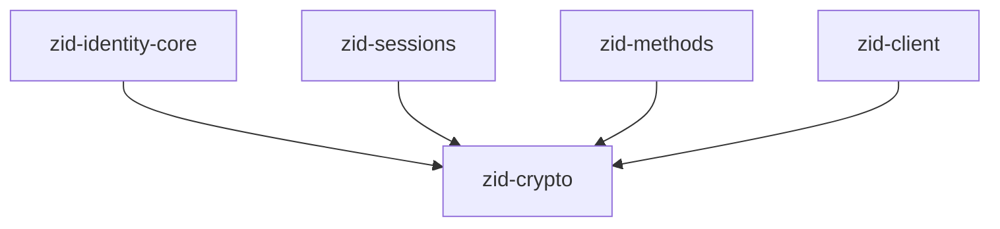
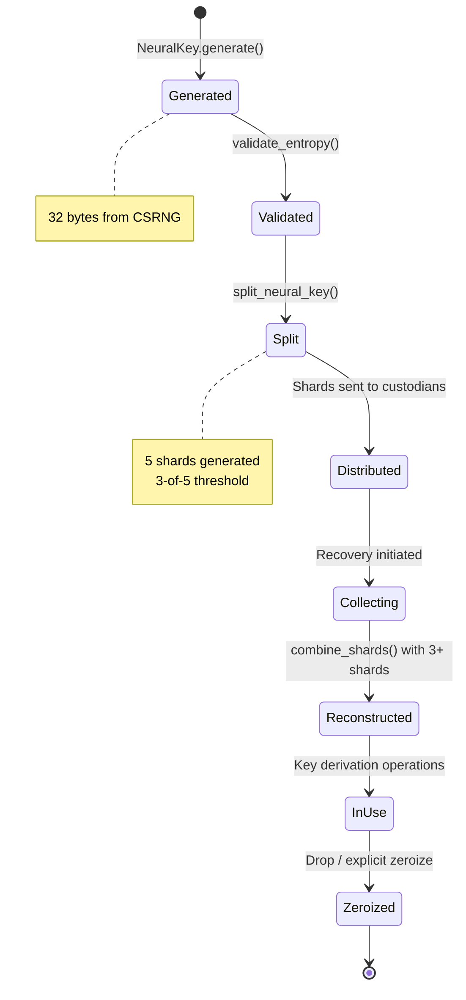
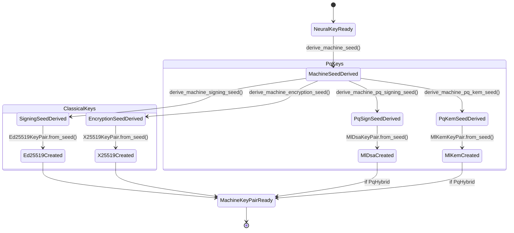
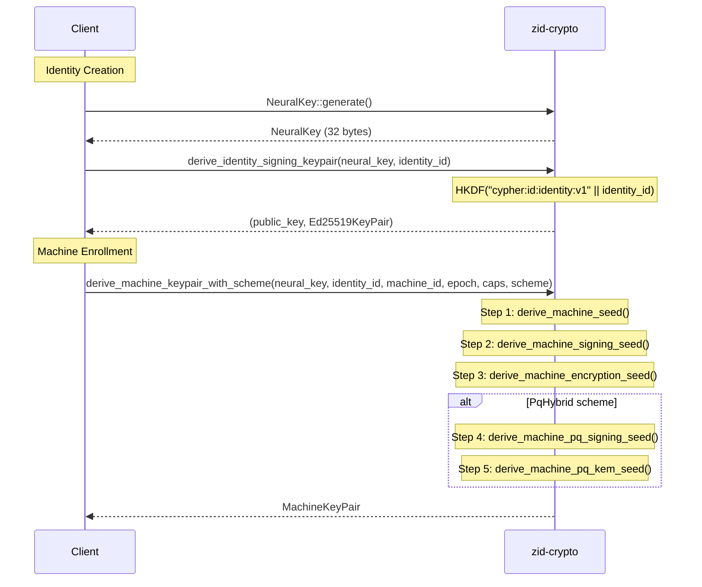
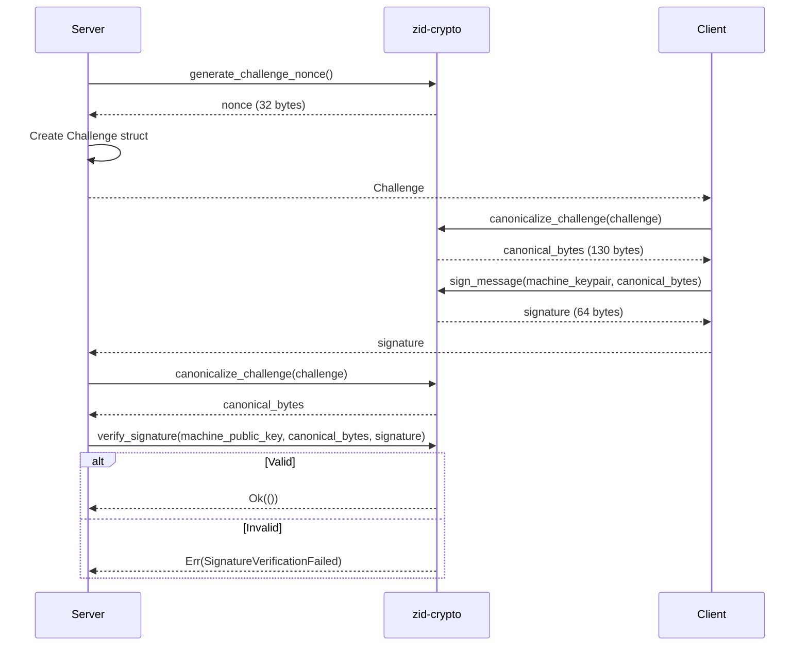

# zid-crypto Specification v0.1.1

## 1. Overview

The `zid-crypto` crate provides all cryptographic primitives for the Zero-ID system. It is the most fundamental crate in the dependency hierarchy, with no internal dependencies on other Zero-ID crates.

### 1.1 Purpose and Responsibilities

- **Key Generation**: Generate Neural Keys, Ed25519 signing keys, X25519 encryption keys
- **Key Derivation**: Hierarchical key derivation using HKDF-SHA256 with domain separation
- **Encryption**: XChaCha20-Poly1305 AEAD encryption/decryption
- **Signatures**: Ed25519 signing and verification with canonical message formats
- **Hashing**: BLAKE3 for fast hashing, Argon2id for password hashing
- **Secret Sharing**: 3-of-5 Shamir Secret Sharing for Neural Key backup
- **DID**: Decentralized Identifier generation and parsing (`did:key` format)
- **Post-Quantum**: ML-DSA-65 signing and ML-KEM-768 key encapsulation

### 1.2 Security Properties

- All sensitive material is zeroized after use via the `zeroize` crate
- Constant-time operations where applicable (signature verification, password comparison)
- No unsafe code (`#![forbid(unsafe_code)]`)
- Strict domain separation for all key derivations
- 192-bit nonces for XChaCha20 (collision-resistant for random generation)

### 1.3 Position in Dependency Graph



---

## 2. Public Interface

### 2.1 Key Types

#### NeuralKey

The root cryptographic seed from which all identity keys are derived.

```rust
/// 32-byte root secret with automatic zeroization
pub struct NeuralKey([u8; 32]);

impl NeuralKey {
    /// Generate a new Neural Key using cryptographically secure RNG
    pub fn generate() -> Result<Self>;
    
    /// Create from existing bytes (e.g., after Shamir reconstruction)
    pub fn from_bytes(bytes: [u8; 32]) -> Self;
    
    /// Get a reference to the key bytes
    pub fn as_bytes(&self) -> &[u8; 32];
    
    /// Validate that the Neural Key has sufficient entropy
    pub fn validate_entropy(&self) -> Result<()>;
}
```

**Security Requirements:**
- MUST be generated client-side only
- MUST NEVER be transmitted over network
- MUST NEVER be stored whole on any system
- MUST be protected via Shamir Secret Sharing
- MUST be zeroized immediately after use

#### Ed25519KeyPair

```rust
pub struct Ed25519KeyPair {
    private_key: SigningKey,    // 32 bytes, zeroized on drop
    public_key: VerifyingKey,   // 32 bytes
}

impl Ed25519KeyPair {
    pub fn from_seed(seed: &[u8; 32]) -> Result<Self>;
    pub fn public_key_bytes(&self) -> [u8; 32];
    pub fn seed_bytes(&self) -> [u8; 32];
    pub fn private_key(&self) -> &SigningKey;
    pub fn public_key(&self) -> &VerifyingKey;
}
```

#### X25519KeyPair

```rust
pub struct X25519KeyPair {
    private_key: StaticSecret,  // 32 bytes, zeroized on drop
    public_key: PublicKey,      // 32 bytes
}

impl X25519KeyPair {
    pub fn from_seed(seed: &[u8; 32]) -> Result<Self>;
    pub fn public_key_bytes(&self) -> [u8; 32];
    pub fn diffie_hellman(&self, their_public: &PublicKey) -> [u8; 32];
}
```

#### MachineKeyPair

```rust
pub struct MachineKeyPair {
    signing_key: Ed25519KeyPair,
    encryption_key: X25519KeyPair,
    capabilities: MachineKeyCapabilities,
}

impl MachineKeyPair {
    pub fn from_seeds(
        signing_seed: &[u8; 32],
        encryption_seed: &[u8; 32],
        capabilities: MachineKeyCapabilities,
    ) -> Result<Self>;
    
    pub fn signing_public_key(&self) -> [u8; 32];
    pub fn encryption_public_key(&self) -> [u8; 32];
    pub fn capabilities(&self) -> MachineKeyCapabilities;
}
```

#### KeyScheme

```rust
#[derive(Debug, Clone, Copy, PartialEq, Eq, Default)]
pub enum KeyScheme {
    /// Classical only: Ed25519 + X25519
    #[default]
    Classical,
    /// PQ-Hybrid: Classical + ML-DSA-65 + ML-KEM-768
    PqHybrid,
}
```

#### MachineKeyCapabilities

```rust
bitflags! {
    pub struct MachineKeyCapabilities: u32 {
        const AUTHENTICATE     = 0b00000001;  // Can authenticate to zid
        const SIGN             = 0b00000010;  // Can sign challenges
        const ENCRYPT          = 0b00000100;  // Can encrypt/decrypt
        const SVK_UNWRAP       = 0b00001000;  // Can unwrap vault keys
        const MLS_MESSAGING    = 0b00010000;  // Can participate in MLS groups
        const VAULT_OPERATIONS = 0b00100000;  // Can access zero-vault
        
        const FULL_DEVICE     = 0b00111111;  // All capabilities
        const SERVICE_MACHINE = 0b00100011;  // AUTHENTICATE | SIGN | VAULT_OPERATIONS
        const LIMITED_DEVICE  = 0b00010011;  // AUTHENTICATE | SIGN | MLS_MESSAGING
    }
}
```

### 2.2 Post-Quantum Key Types

#### MlDsaKeyPair (ML-DSA-65)

```rust
pub struct MlDsaKeyPair {
    secret_key: Vec<u8>,  // 4032 bytes
    public_key: Vec<u8>,  // 1952 bytes
}

impl MlDsaKeyPair {
    pub fn from_seed(seed: &[u8; 32]) -> Result<Self>;
    pub fn public_key(&self) -> &[u8];
    pub fn sign(&self, message: &[u8]) -> Result<Vec<u8>>;  // 3309 bytes
    pub fn verify(public_key: &[u8], message: &[u8], signature: &[u8]) -> Result<()>;
}
```

#### MlKemKeyPair (ML-KEM-768)

```rust
pub struct MlKemKeyPair {
    decapsulation_key: Vec<u8>,  // 2400 bytes
    encapsulation_key: Vec<u8>,  // 1184 bytes
}

impl MlKemKeyPair {
    pub fn from_seed(seed: &[u8; 64]) -> Result<Self>;
    pub fn encapsulation_key(&self) -> &[u8];
    pub fn encapsulate(encapsulation_key: &[u8]) -> Result<(Vec<u8>, [u8; 32])>;
    pub fn decapsulate(&self, ciphertext: &[u8]) -> Result<[u8; 32]>;
}
```

### 2.3 Key Derivation Functions

```rust
/// Generic HKDF derivation
pub fn hkdf_derive(ikm: &[u8], info: &[u8], output_len: usize) -> Result<Vec<u8>>;

/// Fixed 32-byte output HKDF
pub fn hkdf_derive_32(ikm: &[u8], info: &[u8]) -> Result<[u8; 32]>;

/// Derive Identity Signing Keypair from Neural Key
pub fn derive_identity_signing_keypair(
    neural_key: &NeuralKey,
    identity_id: &Uuid,
) -> Result<([u8; 32], Ed25519KeyPair)>;

/// Derive Managed Identity Signing Keypair (server-side)
pub fn derive_managed_identity_signing_keypair(
    service_master_key: &[u8; 32],
    method_type: &str,
    method_id: &str,
) -> Result<([u8; 32], Ed25519KeyPair)>;

/// Derive Machine Key seed
pub fn derive_machine_seed(
    neural_key: &NeuralKey,
    identity_id: &Uuid,
    machine_id: &Uuid,
    epoch: u64,
) -> Result<Zeroizing<[u8; 32]>>;

/// Derive Machine signing seed
pub fn derive_machine_signing_seed(
    machine_seed: &[u8; 32],
    machine_id: &Uuid,
) -> Result<Zeroizing<[u8; 32]>>;

/// Derive Machine encryption seed
pub fn derive_machine_encryption_seed(
    machine_seed: &[u8; 32],
    machine_id: &Uuid,
) -> Result<Zeroizing<[u8; 32]>>;

/// Derive Machine PQ signing seed
pub fn derive_machine_pq_signing_seed(
    machine_seed: &[u8; 32],
    machine_id: &Uuid,
) -> Result<Zeroizing<[u8; 32]>>;

/// Derive Machine PQ KEM seed
pub fn derive_machine_pq_kem_seed(
    machine_seed: &[u8; 32],
    machine_id: &Uuid,
) -> Result<Zeroizing<[u8; 64]>>;

/// High-level: Derive complete Machine Key pair with scheme
pub fn derive_machine_keypair_with_scheme(
    neural_key: &NeuralKey,
    identity_id: &Uuid,
    machine_id: &Uuid,
    epoch: u64,
    capabilities: MachineKeyCapabilities,
    scheme: KeyScheme,
) -> Result<MachineKeyPair>;

/// Derive MFA Key Encryption Key
pub fn derive_mfa_kek(
    neural_key: &NeuralKey,
    identity_id: &Uuid,
) -> Result<Zeroizing<[u8; 32]>>;

/// Derive JWT signing key seed
pub fn derive_jwt_signing_seed(
    service_master_key: &[u8; 32],
    key_epoch: u64,
) -> Result<Zeroizing<[u8; 32]>>;
```

### 2.4 DID Functions

```rust
/// Convert Ed25519 public key to did:key format
pub fn ed25519_to_did_key(public_key: &[u8; 32]) -> String;

/// Parse did:key to Ed25519 public key
pub fn did_key_to_ed25519(did: &str) -> Result<[u8; 32]>;

/// Validate did:key format
pub fn is_valid_ed25519_did_key(did: &str) -> bool;
```

### 2.5 Encryption Functions

```rust
/// Encrypt with XChaCha20-Poly1305
pub fn encrypt(
    key: &[u8; 32],
    plaintext: &[u8],
    nonce: &[u8; 24],
    aad: &[u8],
) -> Result<Vec<u8>>;

/// Decrypt with XChaCha20-Poly1305
pub fn decrypt(
    key: &[u8; 32],
    ciphertext: &[u8],
    nonce: &[u8; 24],
    aad: &[u8],
) -> Result<Vec<u8>>;

/// Encrypt MFA TOTP secret
pub fn encrypt_mfa_secret(
    mfa_kek: &[u8; 32],
    totp_secret: &[u8],
    nonce: &[u8; 24],
    identity_id: &Uuid,
) -> Result<Vec<u8>>;

/// Decrypt MFA TOTP secret
pub fn decrypt_mfa_secret(
    mfa_kek: &[u8; 32],
    ciphertext: &[u8],
    nonce: &[u8; 24],
    identity_id: &Uuid,
) -> Result<Vec<u8>>;

/// Encrypt JWT signing key
pub fn encrypt_jwt_signing_key(
    service_master_key: &[u8; 32],
    private_key: &[u8; 32],
    nonce: &[u8; 24],
    key_id: &[u8; 16],
    epoch: u64,
) -> Result<Vec<u8>>;

/// Decrypt JWT signing key
pub fn decrypt_jwt_signing_key(
    service_master_key: &[u8; 32],
    ciphertext: &[u8],
    nonce: &[u8; 24],
    key_id: &[u8; 16],
    epoch: u64,
) -> Result<Vec<u8>>;
```

### 2.6 Signature Functions

```rust
/// Sign a message with Ed25519
pub fn sign_message(keypair: &Ed25519KeyPair, message: &[u8]) -> [u8; 64];

/// Verify an Ed25519 signature
pub fn verify_signature(
    public_key: &[u8; 32],
    message: &[u8],
    signature: &[u8; 64],
) -> Result<()>;
```

#### Canonical Message Formats

```rust
/// Identity creation message (137 bytes)
pub fn canonicalize_identity_creation_message(
    identity_id: &Uuid,
    identity_signing_public_key: &[u8; 32],
    first_machine_id: &Uuid,
    machine_signing_key: &[u8; 32],
    machine_encryption_key: &[u8; 32],
    created_at: u64,
) -> [u8; 137];

/// Machine enrollment message (109 bytes)
pub fn canonicalize_enrollment_message(
    machine_id: &Uuid,
    namespace_id: &Uuid,
    signing_public_key: &[u8; 32],
    encryption_public_key: &[u8; 32],
    capabilities: u32,
    created_at: u64,
) -> [u8; 109];

/// Recovery approval message (73 bytes)
pub fn canonicalize_recovery_approval_message(
    identity_id: &Uuid,
    recovery_machine_id: &Uuid,
    recovery_signing_key: &[u8; 32],
    timestamp: u64,
) -> [u8; 73];

/// Rotation approval message (57 bytes)
pub fn canonicalize_rotation_approval_message(
    identity_id: &Uuid,
    new_identity_signing_public_key: &[u8; 32],
    timestamp: u64,
) -> [u8; 57];

/// Challenge canonical format (130 bytes)
pub fn canonicalize_challenge(challenge: &Challenge) -> [u8; 130];
```

### 2.7 Hashing Functions

```rust
/// BLAKE3 hash
pub fn blake3_hash(data: &[u8]) -> [u8; 32];

/// Derive key ID from public key
pub fn derive_key_id(public_key: &[u8; 32]) -> [u8; 16];

/// Hash password with Argon2id
pub fn hash_password(password: &[u8], salt: &SaltString) -> Result<String>;

/// Verify password against Argon2id hash
pub fn verify_password(password: &[u8], hash_str: &str) -> Result<()>;

/// Generate random salt
pub fn generate_salt() -> SaltString;

/// Constant-time comparison
pub fn constant_time_compare(a: &[u8], b: &[u8]) -> bool;
```

### 2.8 Shamir Secret Sharing

```rust
pub struct NeuralShard {
    pub index: u8,        // 1-255 (typically 1-5)
    pub data: [u8; 32],   // Same length as secret
}

impl NeuralShard {
    pub fn new(index: u8, data: [u8; 32]) -> Self;
    pub fn to_hex(&self) -> String;           // 66 hex chars
    pub fn from_hex(hex_str: &str) -> Result<Self>;
    pub fn to_bytes(&self) -> Vec<u8>;        // 33 bytes
    pub fn from_bytes(bytes: &[u8]) -> Result<Self>;
}

/// Split Neural Key into 5 shards (3-of-5 threshold)
pub fn split_neural_key(neural_key: &NeuralKey) -> Result<[NeuralShard; 5]>;

/// Combine 3-5 shards to reconstruct Neural Key
pub fn combine_shards(shards: &[NeuralShard]) -> Result<NeuralKey>;
```

### 2.9 Types

#### Challenge

```rust
pub struct Challenge {
    pub challenge_id: Uuid,
    pub entity_id: Uuid,
    pub entity_type: EntityType,
    pub purpose: String,
    pub aud: String,
    pub iat: u64,
    pub exp: u64,
    pub nonce: [u8; 32],
    pub used: bool,
}

#[repr(u8)]
pub enum EntityType {
    Machine = 0x01,
    Wallet = 0x02,
    Email = 0x03,
}
```

### 2.10 Error Types

```rust
pub enum CryptoError {
    InvalidKeySize { expected: usize, actual: usize },
    InvalidNonceSize { expected: usize, actual: usize },
    InvalidSignature,
    SignatureVerificationFailed,
    EncryptionFailed(String),
    DecryptionFailed(String),
    KeyDerivationFailed(String),
    InvalidInput(String),
    RandomGenerationFailed(String),
    Argon2Failed(String),
    InvalidHashFormat,
    Ed25519Error(String),
    X25519Error(String),
    HkdfError,
    SerializationError(String),
    DeserializationError(String),
    ShamirSplitFailed(String),
    ShamirCombineFailed(String),
    InsufficientShards { required: usize, provided: usize },
    TooManyShards { maximum: usize, provided: usize },
    DuplicateShardIndex(u8),
    InvalidShardFormat(String),
    InvalidDidFormat(String),
    MlDsaError(String),
    MlKemError(String),
}
```

---

## 3. State Machines

### 3.1 Neural Key Lifecycle



### 3.2 Machine Key Derivation Flow



---

## 4. Control Flow

### 4.1 Key Derivation Hierarchy



### 4.2 Challenge-Response Authentication



### 4.3 Neural Key Recovery

```mermaid
sequenceDiagram
    participant User
    participant Crypto as zid-crypto
    participant Custodians
    
    Note over User: Backup (during identity creation)
    User->>Crypto: split_neural_key(neural_key)
    Crypto-->>User: [NeuralShard; 5]
    loop For each shard
        User->>User: shard.to_hex()
        User-->>Custodians: Distribute shard
    end
    
    Note over User: Recovery (when needed)
    loop Collect 3+ shards
        Custodians-->>User: shard_hex
        User->>Crypto: NeuralShard::from_hex(shard_hex)
        Crypto-->>User: NeuralShard
    end
    User->>Crypto: combine_shards(shards)
    alt 3+ valid shards
        Crypto-->>User: NeuralKey
    else less than 3 shards
        Crypto-->>User: Err(InsufficientShards)
    end
```

---

## 5. Data Structures

### 5.1 Binary Message Formats

All multi-byte integers use **big-endian** (network byte order).

#### Identity Creation Authorization (137 bytes)

| Offset | Size | Field | Description |
|--------|------|-------|-------------|
| 0 | 1 | version | Protocol version (0x01) |
| 1 | 16 | identity_id | UUID bytes |
| 17 | 32 | identity_signing_public_key | Ed25519 public key |
| 49 | 16 | first_machine_id | UUID bytes |
| 65 | 32 | machine_signing_key | Ed25519 public key |
| 97 | 32 | machine_encryption_key | X25519 public key |
| 129 | 8 | created_at | Unix timestamp (big-endian u64) |

#### Machine Enrollment Authorization (109 bytes)

| Offset | Size | Field | Description |
|--------|------|-------|-------------|
| 0 | 1 | version | Protocol version (0x01) |
| 1 | 16 | machine_id | UUID bytes |
| 17 | 16 | namespace_id | UUID bytes |
| 33 | 32 | signing_public_key | Ed25519 public key |
| 65 | 32 | encryption_public_key | X25519 public key |
| 97 | 4 | capabilities | Capability bitflags (big-endian u32) |
| 101 | 8 | created_at | Unix timestamp (big-endian u64) |

#### Recovery Approval (73 bytes)

| Offset | Size | Field | Description |
|--------|------|-------|-------------|
| 0 | 1 | version | Protocol version (0x01) |
| 1 | 16 | identity_id | UUID bytes |
| 17 | 16 | recovery_machine_id | UUID bytes |
| 33 | 32 | recovery_signing_key | Ed25519 public key |
| 65 | 8 | timestamp | Unix timestamp (big-endian u64) |

#### Rotation Approval (57 bytes)

| Offset | Size | Field | Description |
|--------|------|-------|-------------|
| 0 | 1 | version | Protocol version (0x01) |
| 1 | 16 | identity_id | UUID bytes |
| 17 | 32 | new_identity_signing_public_key | New Ed25519 public key |
| 49 | 8 | timestamp | Unix timestamp (big-endian u64) |

#### Challenge Canonical Format (130 bytes)

| Offset | Size | Field | Description |
|--------|------|-------|-------------|
| 0 | 1 | version | Protocol version (0x01) |
| 1 | 16 | challenge_id | UUID bytes |
| 17 | 16 | entity_id | UUID bytes |
| 33 | 1 | entity_type | 0x01=Machine, 0x02=Wallet, 0x03=Email |
| 34 | 16 | purpose | Zero-padded UTF-8 |
| 50 | 32 | aud | Zero-padded UTF-8 |
| 82 | 8 | iat | Issued-at timestamp (big-endian u64) |
| 90 | 8 | exp | Expiry timestamp (big-endian u64) |
| 98 | 32 | nonce | Random bytes |

### 5.2 Neural Shard Format (33 bytes)

| Offset | Size | Field | Description |
|--------|------|-------|-------------|
| 0 | 1 | index | Shard index (1-255, typically 1-5) |
| 1 | 32 | data | Shard data |

Hex encoding: 66 characters (2 chars per byte)

---

## 6. Security Considerations

### 6.1 Cryptographic Requirements

| Requirement | Implementation |
|-------------|----------------|
| Key size | 256 bits (32 bytes) for all symmetric keys |
| Signature size | 512 bits (64 bytes) for Ed25519 |
| Nonce size | 192 bits (24 bytes) for XChaCha20 |
| Auth tag size | 128 bits (16 bytes) for Poly1305 |
| Password hash | Argon2id: 64 MiB memory, 3 iterations |
| Secret sharing | 3-of-5 Shamir over GF(256) |

### 6.2 Post-Quantum Key Sizes

| Algorithm | Public Key | Secret Key | Signature/Ciphertext |
|-----------|------------|------------|----------------------|
| ML-DSA-65 | 1952 bytes | 4032 bytes | 3309 bytes |
| ML-KEM-768 | 1184 bytes | 2400 bytes | 1088 bytes |

### 6.3 Domain Separation

All domain strings follow the format: `cypher:{service}:{purpose}:v{version}`

| Domain String | Purpose |
|---------------|---------|
| `cypher:id:identity:v1` | Identity Signing Key derivation |
| `cypher:managed:identity:v1` | Managed Identity ISK derivation |
| `cypher:shared:machine:v1` | Machine seed derivation |
| `cypher:shared:machine:sign:v1` | Machine signing key derivation |
| `cypher:shared:machine:encrypt:v1` | Machine encryption key derivation |
| `cypher:shared:machine:pq-sign:v1` | Machine PQ signing key derivation |
| `cypher:shared:machine:pq-kem:v1` | Machine PQ KEM key derivation |
| `cypher:id:jwt:v1` | JWT signing key derivation |
| `cypher:id:mfa-kek:v1` | MFA Key Encryption Key derivation |
| `cypher:id:mfa-totp:v1` | MFA TOTP secret AAD |
| `cypher:share-backup-kek:v1` | Recovery share backup KEK |
| `cypher:share-backup:v1` | Recovery share backup AAD |

### 6.4 Zeroization

The following types implement `Zeroize` and `ZeroizeOnDrop`:
- `NeuralKey` — Explicitly zeroizes internal buffer
- `Ed25519KeyPair` — Via `ed25519-dalek` SigningKey
- `X25519KeyPair` — Via `x25519-dalek` StaticSecret
- All `Zeroizing<T>` wrappers for derived seeds

---

## 7. Dependencies

### 7.1 Internal Crate Dependencies

None. This is the foundational crate.

### 7.2 External Dependencies

| Crate | Version | Purpose |
|-------|---------|---------|
| `chacha20poly1305` | 0.10 | XChaCha20-Poly1305 AEAD |
| `hkdf` | 0.12 | HKDF-SHA256 key derivation |
| `sha2` | 0.10 | SHA-256 for HKDF |
| `ed25519-dalek` | 2.0 | Ed25519 signatures |
| `x25519-dalek` | 2.0 | X25519 key agreement |
| `blake3` | 1.5 | Fast hashing |
| `argon2` | 0.5 | Password hashing |
| `zeroize` | 1.7 | Secure memory clearing |
| `rand` | 0.8 | RNG utilities |
| `getrandom` | 0.2 | WASM-compatible CSPRNG |
| `sharks` | 0.5 | Shamir Secret Sharing |
| `fips204` | 0.4 | ML-DSA-65 (NIST FIPS 204) |
| `fips203` | 0.4 | ML-KEM-768 (NIST FIPS 203) |
| `bs58` | 0.5 | Base58 encoding for DIDs |
| `serde` | 1.0 | Serialization |
| `hex` | 0.4 | Hex encoding |
| `base64` | 0.21 | Base64 encoding |
| `uuid` | 1.6 | UUID handling |
| `thiserror` | 1.0 | Error types |
| `bitflags` | 2.4 | Capability flags |

---

## 8. Constants Reference

```rust
// Key sizes
pub const NEURAL_KEY_SIZE: usize = 32;
pub const PUBLIC_KEY_SIZE: usize = 32;
pub const PRIVATE_KEY_SIZE: usize = 32;
pub const SIGNATURE_SIZE: usize = 64;

// Post-quantum sizes
pub const ML_DSA_65_PUBLIC_KEY_SIZE: usize = 1952;
pub const ML_DSA_65_SECRET_KEY_SIZE: usize = 4032;
pub const ML_DSA_65_SIGNATURE_SIZE: usize = 3309;
pub const ML_KEM_768_PUBLIC_KEY_SIZE: usize = 1184;
pub const ML_KEM_768_SECRET_KEY_SIZE: usize = 2400;
pub const ML_KEM_768_CIPHERTEXT_SIZE: usize = 1088;

// Encryption
pub const NONCE_SIZE: usize = 24;
pub const TAG_SIZE: usize = 16;

// Hashing
pub const HKDF_OUTPUT_SIZE: usize = 32;
pub const ARGON2_SALT_SIZE: usize = 32;

// Challenges
pub const CHALLENGE_NONCE_SIZE: usize = 32;
pub const CHALLENGE_EXPIRY_SECONDS: u64 = 60;

// Sessions
pub const SESSION_TOKEN_EXPIRY_SECONDS: u64 = 900;      // 15 minutes
pub const REFRESH_TOKEN_EXPIRY_SECONDS: u64 = 2_592_000; // 30 days

// Ceremonies
pub const APPROVAL_EXPIRY_SECONDS: u64 = 900;   // 15 minutes
pub const OPERATION_EXPIRY_SECONDS: u64 = 3600; // 1 hour

// Shamir
pub const SHAMIR_THRESHOLD: usize = 3;
pub const SHAMIR_TOTAL_SHARES: usize = 5;

// MFA
pub const MFA_BACKUP_CODES_COUNT: usize = 10;

// Argon2id parameters
pub mod argon2_params {
    pub const MEMORY_COST: u32 = 64 * 1024;  // 64 MiB
    pub const TIME_COST: u32 = 3;             // 3 iterations
    pub const PARALLELISM: u32 = 1;           // 1 thread
    pub const OUTPUT_LENGTH: usize = 32;      // 32 bytes
}
```
