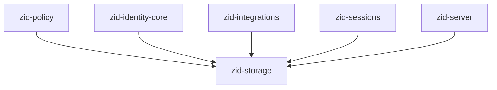
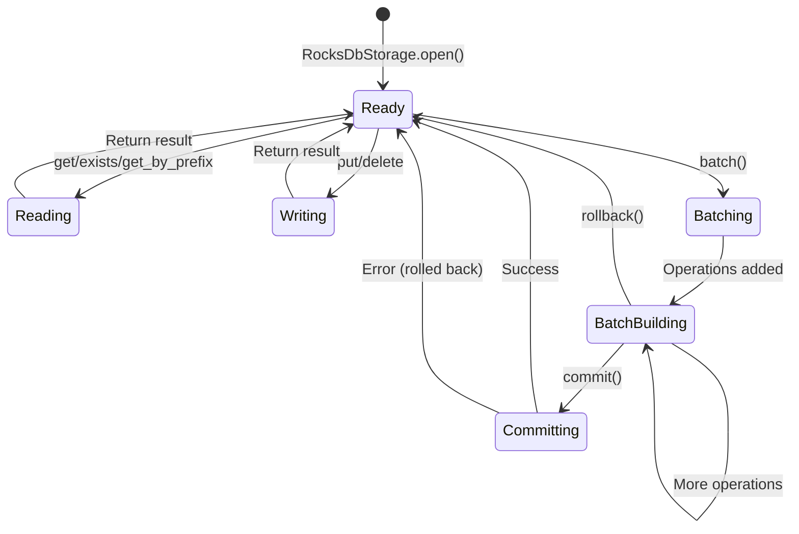
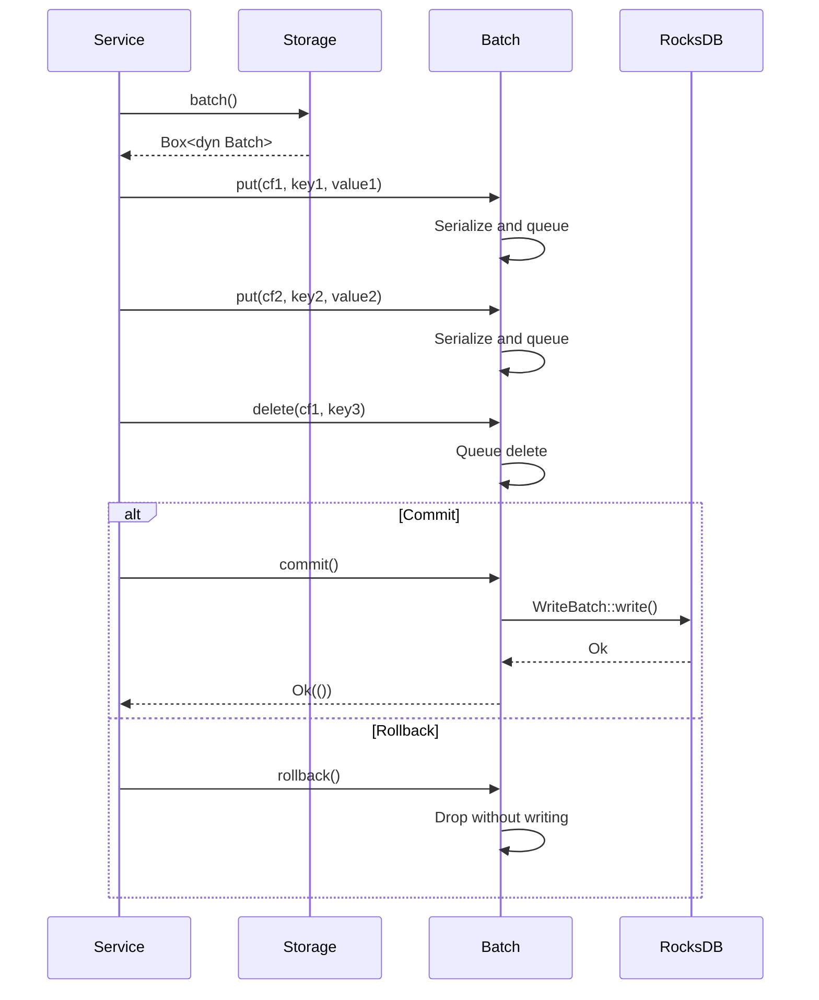
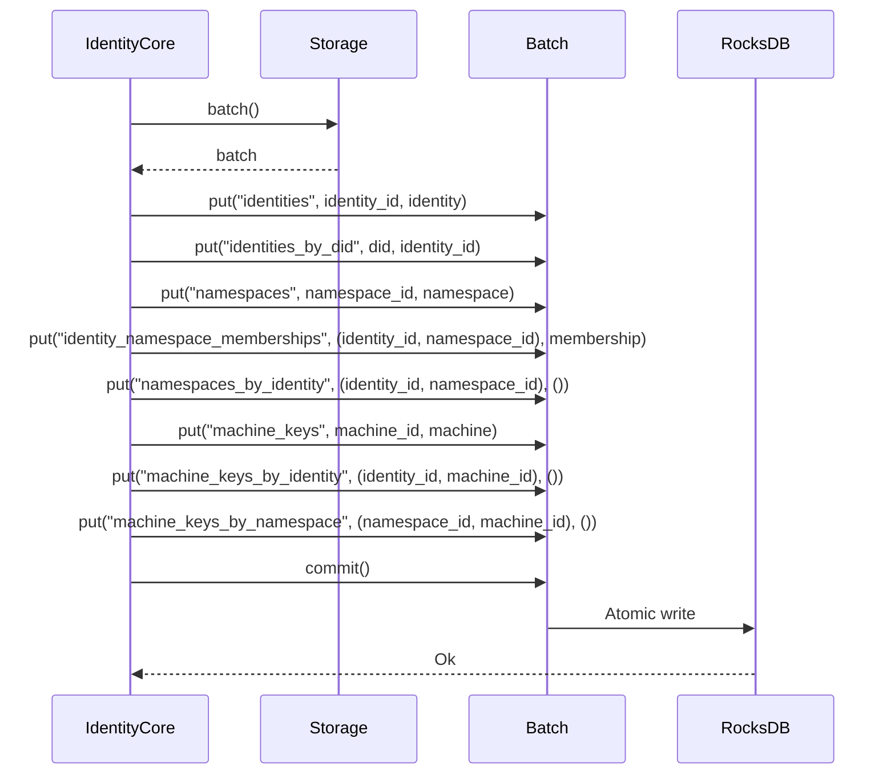
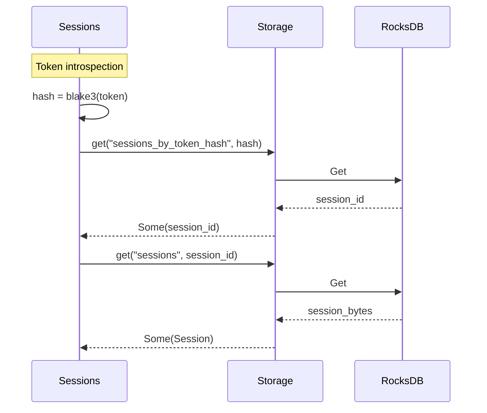

# zid-storage Specification v0.1.1

## 1. Overview

The `zid-storage` crate provides the storage abstraction layer for Zero-ID. It defines traits for key-value operations and implements a RocksDB backend with 33 column families for data isolation.

### 1.1 Purpose and Responsibilities

- **Storage Abstraction**: Define `Storage` and `Batch` traits for key-value operations
- **Column Families**: 33 distinct column families for logical data separation
- **Atomic Operations**: Batch writes for transactional consistency
- **Serialization**: Bincode-based key/value serialization
- **RocksDB Implementation**: Production storage backend with Snappy compression

### 1.2 Position in Dependency Graph



---

## 2. Public Interface

### 2.1 Storage Trait

The primary trait for key-value operations.

```rust
#[async_trait]
pub trait Storage: Send + Sync {
    /// Get a value by key from a column family
    async fn get<K, V>(&self, cf: &str, key: &K) -> Result<Option<V>>
    where
        K: Serialize + Send + Sync,
        V: DeserializeOwned;

    /// Put a key-value pair into a column family
    async fn put<K, V>(&self, cf: &str, key: &K, value: &V) -> Result<()>
    where
        K: Serialize + Send + Sync,
        V: Serialize + Send + Sync;

    /// Delete a key from a column family
    async fn delete<K>(&self, cf: &str, key: &K) -> Result<()>
    where
        K: Serialize + Send + Sync;

    /// Check if a key exists in a column family
    async fn exists<K>(&self, cf: &str, key: &K) -> Result<bool>
    where
        K: Serialize + Send + Sync;

    /// Get multiple values by prefix (range query)
    async fn get_by_prefix<K, V>(&self, cf: &str, prefix: &K) -> Result<Vec<(Vec<u8>, V)>>
    where
        K: Serialize + Send + Sync,
        V: DeserializeOwned;

    /// Scan all entries in a column family
    async fn scan_all<V>(&self, cf: &str) -> Result<Vec<(Vec<u8>, V)>>
    where
        V: DeserializeOwned;

    /// Create a new batch for atomic operations
    fn batch(&self) -> Box<dyn Batch>;

    /// Begin a transaction (for multi-CF atomic operations)
    async fn begin_transaction(&self) -> Result<Box<dyn Batch>>;
}
```

### 2.2 Batch Trait

Interface for atomic batch operations.

```rust
#[async_trait]
pub trait Batch: Send {
    /// Put a pre-serialized key-value pair in the batch
    fn put_raw(&mut self, cf: &str, key: Vec<u8>, value: Vec<u8>) -> Result<()>;

    /// Delete a pre-serialized key in the batch
    fn delete_raw(&mut self, cf: &str, key: Vec<u8>) -> Result<()>;

    /// Commit the batch atomically
    async fn commit(self: Box<Self>) -> Result<()>;

    /// Rollback the batch (drop without committing)
    fn rollback(self: Box<Self>);
}
```

### 2.3 BatchExt Trait

Type-safe extension methods for Batch.

```rust
pub trait BatchExt: Batch {
    /// Put a key-value pair in the batch (type-safe)
    fn put<K, V>(&mut self, cf: &str, key: &K, value: &V) -> Result<()>
    where
        K: Serialize,
        V: Serialize;

    /// Delete a key in the batch (type-safe)
    fn delete<K>(&mut self, cf: &str, key: &K) -> Result<()>
    where
        K: Serialize;
}

// Automatically implemented for all Batch types
impl<T: Batch + ?Sized> BatchExt for T {}
```

### 2.4 RocksDB Implementation

```rust
pub struct RocksDbStorage {
    db: Arc<DB>,
}

impl RocksDbStorage {
    /// Open or create a RocksDB database at the given path
    pub fn open(path: impl AsRef<Path>) -> Result<Self>;
    
    /// Get the underlying RocksDB handle (for advanced operations)
    pub fn db(&self) -> &DB;
}
```

### 2.5 Error Types

```rust
#[derive(Debug, thiserror::Error)]
pub enum StorageError {
    #[error("Key not found")]
    NotFound,
    
    #[error("Serialization error: {0}")]
    Serialization(String),
    
    #[error("Deserialization error: {0}")]
    Deserialization(String),
    
    #[error("RocksDB error: {0}")]
    RocksDb(String),
    
    #[error("Column family not found: {0}")]
    ColumnFamilyNotFound(String),
    
    #[error("Transaction error: {0}")]
    Transaction(String),
}

pub type Result<T> = std::result::Result<T, StorageError>;
```

---

## 3. Column Families

### 3.1 Complete List (33 Column Families)

```rust
// Identity
pub const CF_IDENTITIES: &str = "identities";
pub const CF_IDENTITIES_BY_DID: &str = "identities_by_did";
pub const CF_MACHINE_KEYS: &str = "machine_keys";
pub const CF_MACHINE_KEYS_BY_IDENTITY: &str = "machine_keys_by_identity";
pub const CF_MACHINE_KEYS_BY_NAMESPACE: &str = "machine_keys_by_namespace";
pub const CF_NAMESPACES: &str = "namespaces";
pub const CF_IDENTITY_NAMESPACE_MEMBERSHIPS: &str = "identity_namespace_memberships";
pub const CF_NAMESPACES_BY_IDENTITY: &str = "namespaces_by_identity";

// Auth Credentials
pub const CF_AUTH_CREDENTIALS: &str = "auth_credentials";
pub const CF_MFA_SECRETS: &str = "mfa_secrets";
pub const CF_CHALLENGES: &str = "challenges";
pub const CF_USED_NONCES: &str = "used_nonces";

// Auth Links (new in v0.1.1)
pub const CF_AUTH_LINKS: &str = "auth_links";
pub const CF_AUTH_LINKS_BY_METHOD: &str = "auth_links_by_method";
pub const CF_PRIMARY_AUTH_METHOD: &str = "primary_auth_method";

// OAuth
pub const CF_OAUTH_STATES: &str = "oauth_states";
pub const CF_OAUTH_LINKS: &str = "oauth_links";
pub const CF_OAUTH_LINKS_BY_IDENTITY: &str = "oauth_links_by_identity";
pub const CF_OIDC_NONCES: &str = "oidc_nonces";
pub const CF_JWKS_CACHE: &str = "jwks_cache";

// Wallet
pub const CF_WALLET_CREDENTIALS: &str = "wallet_credentials";
pub const CF_WALLET_CREDENTIALS_BY_IDENTITY: &str = "wallet_credentials_by_identity";

// Sessions
pub const CF_SESSIONS: &str = "sessions";
pub const CF_SESSIONS_BY_IDENTITY: &str = "sessions_by_identity";
pub const CF_SESSIONS_BY_TOKEN_HASH: &str = "sessions_by_token_hash";
pub const CF_REFRESH_TOKENS: &str = "refresh_tokens";
pub const CF_REFRESH_TOKENS_BY_FAMILY: &str = "refresh_tokens_by_family";
pub const CF_SIGNING_KEYS: &str = "signing_keys";

// Integrations
pub const CF_INTEGRATION_SERVICES: &str = "integration_services";
pub const CF_INTEGRATION_SERVICES_BY_CERT: &str = "integration_services_by_cert";
pub const CF_REVOCATION_EVENTS: &str = "revocation_events";
pub const CF_PROCESSED_EVENT_IDS: &str = "processed_event_ids";
pub const CF_WEBHOOK_DELIVERY_LOG: &str = "webhook_delivery_log";

// Policy
pub const CF_REPUTATION: &str = "reputation";
```

### 3.2 Column Family Details

| Column Family | Key | Value | TTL | Description |
|---------------|-----|-------|-----|-------------|
| `identities` | `identity_id: Uuid` | `Identity` | — | Identity records |
| `identities_by_did` | `did: String` | `identity_id: Uuid` | — | DID to identity index |
| `machine_keys` | `machine_id: Uuid` | `MachineKey` | — | Machine key records |
| `machine_keys_by_identity` | `(identity_id, machine_id)` | `()` | — | Index |
| `machine_keys_by_namespace` | `(namespace_id, machine_id)` | `()` | — | Index |
| `namespaces` | `namespace_id: Uuid` | `Namespace` | — | Namespace records |
| `identity_namespace_memberships` | `(identity_id, namespace_id)` | `Membership` | — | Membership records |
| `namespaces_by_identity` | `(identity_id, namespace_id)` | `()` | — | Index |
| `auth_credentials` | `(identity_id, cred_type)` | `Credential` | — | Auth credentials |
| `mfa_secrets` | `identity_id: Uuid` | `MfaSecret` | — | Encrypted MFA secrets |
| `challenges` | `challenge_id: Uuid` | `Challenge` | 5 min | Auth challenges |
| `used_nonces` | `nonce_hex: String` | `expiry: u64` | 6 min | Replay prevention |
| `auth_links` | `(identity_id, method_type)` | `AuthLinkRecord` | — | Auth method links |
| `auth_links_by_method` | `method_key: String` | `identity_id: Uuid` | — | Method lookup index |
| `primary_auth_method` | `identity_id: Uuid` | `AuthMethodType` | — | Primary auth method |
| `oauth_states` | `state_id: String` | `OAuthState` | 10 min | OAuth flow state |
| `oauth_links` | `(provider, provider_user_id)` | `OAuthLink` | — | OAuth links |
| `oauth_links_by_identity` | `(identity_id, provider)` | `link_id` | — | Index |
| `oidc_nonces` | `nonce: String` | `created_at: u64` | 10 min | OIDC nonces |
| `jwks_cache` | `provider: String` | `JwksKeySet` | 1 hour | Cached JWKS |
| `wallet_credentials` | `wallet_address: String` | `WalletCredential` | — | Wallet credentials |
| `wallet_credentials_by_identity` | `(identity_id, address)` | `()` | — | Index |
| `sessions` | `session_id: Uuid` | `Session` | — | Session records |
| `sessions_by_identity` | `(identity_id, session_id)` | `()` | — | Index |
| `sessions_by_token_hash` | `token_hash: [u8; 32]` | `session_id: Uuid` | — | Token lookup |
| `refresh_tokens` | `token_hash: [u8; 32]` | `RefreshTokenRecord` | — | Refresh tokens |
| `refresh_tokens_by_family` | `(family_id, generation)` | `token_hash` | — | Family lookup |
| `signing_keys` | `key_id: [u8; 16]` | `JwtSigningKey` | — | JWT signing keys |
| `integration_services` | `service_id: Uuid` | `IntegrationService` | — | Service records |
| `integration_services_by_cert` | `fingerprint: [u8; 32]` | `service_id: Uuid` | — | Cert lookup |
| `revocation_events` | `(namespace_id, sequence)` | `RevocationEvent` | — | Event log |
| `processed_event_ids` | `event_id: Uuid` | `processed_at: u64` | 1 hour | Deduplication |
| `webhook_delivery_log` | `(service_id, event_id)` | `DeliveryStatus` | — | Delivery tracking |
| `reputation` | `identity_id: Uuid` | `ReputationRecord` | — | Reputation scores |

---

## 4. State Machines

### 4.1 Storage Operation Flow



### 4.2 Batch Transaction Flow



---

## 5. Data Structures

### 5.1 Key Serialization

Keys are serialized using Bincode for consistency:

```rust
fn serialize_key<K: Serialize>(key: &K) -> Result<Vec<u8>> {
    bincode::serialize(key)
        .map_err(|e| StorageError::Serialization(e.to_string()))
}
```

### 5.2 Value Serialization

Values are also serialized using Bincode:

```rust
fn serialize_value<V: Serialize>(value: &V) -> Result<Vec<u8>> {
    bincode::serialize(value)
        .map_err(|e| StorageError::Serialization(e.to_string()))
}

fn deserialize_value<V: DeserializeOwned>(bytes: &[u8]) -> Result<V> {
    bincode::deserialize(bytes)
        .map_err(|e| StorageError::Deserialization(e.to_string()))
}
```

### 5.3 Composite Key Patterns

For index column families, composite keys are used:

```rust
// Tuple serialization via Bincode
let key = (identity_id, machine_id);  // Serializes as concatenated bytes

// String-based composite keys for method lookups
let method_key = format!("{}:{}", method_type, method_id);
// Example: "email:user@example.com"
// Example: "oauth_google:123456789"
```

---

## 6. Control Flow

### 6.1 Identity Creation Storage Flow



### 6.2 Session Lookup Flow



---

## 7. Security Considerations

### 7.1 Data at Rest

- RocksDB uses Snappy compression by default
- Sensitive data (MFA secrets, JWT private keys) is encrypted before storage
- No built-in encryption at rest (rely on filesystem/volume encryption)

### 7.2 Column Family Isolation

- Each column family has isolated key namespaces
- Prevents key collision between different data types
- Enables targeted backups and compaction

### 7.3 Atomic Operations

- Batch operations are atomic across column families
- Partial failures are impossible (all or nothing)
- Useful for maintaining index consistency

### 7.4 TTL Data

Some data has logical TTLs managed at the application layer:

| Data | TTL | Cleanup |
|------|-----|---------|
| Challenges | 5 minutes | Application-level expiry check |
| Used nonces | 6 minutes | Background cleanup |
| OAuth states | 10 minutes | Application-level expiry check |
| OIDC nonces | 10 minutes | Application-level expiry check |
| JWKS cache | 1 hour | Refresh on access |
| Processed event IDs | 1 hour | Background cleanup |

---

## 8. Dependencies

### 8.1 Internal Crate Dependencies

None. This is a foundational crate.

### 8.2 External Dependencies

| Crate | Version | Purpose |
|-------|---------|---------|
| `rocksdb` | 0.21 | Storage backend (with Snappy) |
| `tokio` | 1.35 | Async runtime |
| `async-trait` | 0.1 | Async trait support |
| `bincode` | 1.3 | Serialization |
| `serde` | 1.0 | Serialization traits |
| `thiserror` | 1.0 | Error types |
| `uuid` | 1.6 | UUID handling |
| `tracing` | 0.1 | Logging |
| `tempfile` | 3.8 | Test utilities |

---

## 9. Usage Examples

### 9.1 Basic Operations

```rust
// Open database
let storage = RocksDbStorage::open("./data/zid.db")?;

// Put a value
storage.put(CF_IDENTITIES, &identity_id, &identity).await?;

// Get a value
let identity: Option<Identity> = storage.get(CF_IDENTITIES, &identity_id).await?;

// Check existence
let exists = storage.exists(CF_IDENTITIES, &identity_id).await?;

// Delete a value
storage.delete(CF_IDENTITIES, &identity_id).await?;
```

### 9.2 Batch Operations

```rust
let mut batch = storage.batch();

// Add multiple operations
batch.put(CF_IDENTITIES, &identity_id, &identity)?;
batch.put(CF_MACHINE_KEYS, &machine_id, &machine)?;
batch.put(CF_MACHINE_KEYS_BY_IDENTITY, &(identity_id, machine_id), &())?;

// Commit atomically
batch.commit().await?;
```

### 9.3 Prefix Queries

```rust
// List all machines for an identity
let machines: Vec<(Vec<u8>, MachineKey)> = storage
    .get_by_prefix(CF_MACHINE_KEYS_BY_IDENTITY, &identity_id)
    .await?;
```
